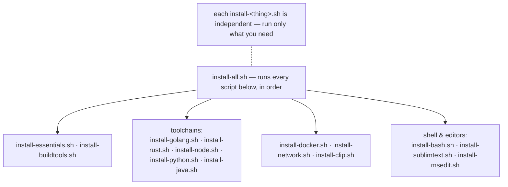

# dev-setup-scripts

**One-shot scripts to bring a fresh Linux box up to a working dev environment.** Each
`install-<thing>.sh` is independent and idempotent-ish; `install-all.sh` runs the lot.

[]()
[]()
[](LICENSE)

## What's in here



> Read the script before running it — most use `sudo` and add apt repositories.

## Usage

```bash
git clone https://github.com/ZZ0R0/dev-setup-scripts
cd dev-setup-scripts

bash install-all.sh          # everything
# or pick what you need:
bash install-essentials.sh   # base packages
bash install-buildtools.sh   # compilers / build deps
bash install-docker.sh
bash install-golang.sh
bash install-rust.sh
bash install-node.sh
bash install-python.sh
bash install-java.sh
bash install-network.sh      # common network tools
bash install-clip.sh         # clipboard tooling
bash install-bash.sh         # shell config
bash install-sublimtext.sh   # Sublime Text
bash install-msedit.sh
```

> Read the script before running it — most use `sudo` and add apt repositories.

## What's here

| Script | Installs |
|---|---|
| `install-all.sh` | runs all of the below in order |
| `install-essentials.sh` | base packages |
| `install-buildtools.sh` | compilers / build dependencies |
| `install-docker.sh` | Docker engine + CLI |
| `install-golang.sh` / `install-rust.sh` / `install-node.sh` / `install-python.sh` / `install-java.sh` | the respective toolchains |
| `install-network.sh` | common networking / recon tools |
| `install-clip.sh` | clipboard utilities |
| `install-bash.sh` | shell configuration |
| `install-sublimtext.sh` / `install-msedit.sh` | editors |

## Status

Personal bootstrap scripts — tested on Debian/Ubuntu. Adjust to taste.

## License

[MIT](LICENSE)
